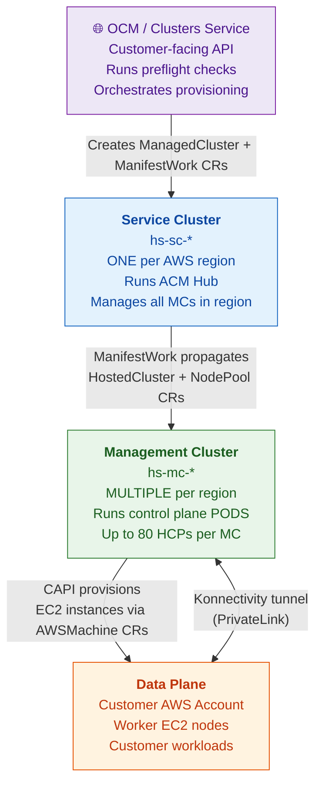
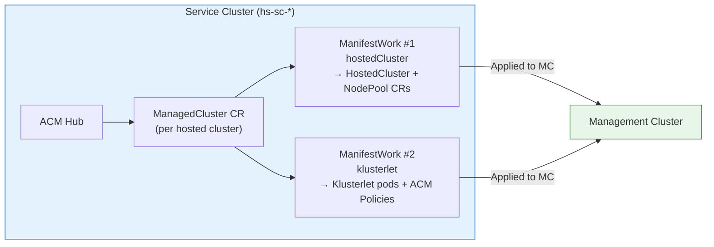
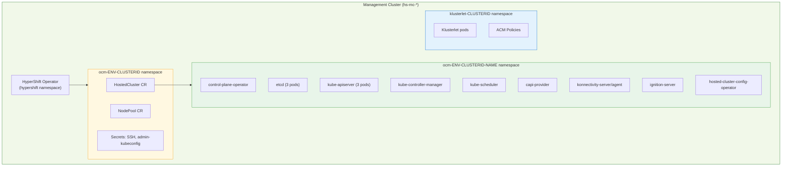
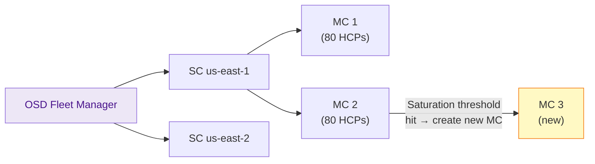

# Architecture Overview

ROSA HCP is realized through **three distinct cluster tiers** that work together. Understanding this layered model is the foundation for everything else.

---

## The Three-Tier Model



---

## Tier 1: OCM / Clusters Service

**Role**: Customer-facing API and orchestrator.

When a customer runs `rosa create cluster --hosted-cp`, OCM:

1. Validates the request (preflight checks against AWS)
2. Selects a Service Cluster in the customer's region (via OSD Fleet Manager provision shards)
3. Creates a `ManagedCluster` CR on the Service Cluster
4. Creates supporting secrets (`signing-key`, `root-CA`) on the Service Cluster
5. Watches the cluster status and reports back to the customer

!!! tip "First place to look for install/delete failures"
    CS (Clusters Service) logs on Grafana (Loki) are often the first indicator of where a provisioning or deprovisioning got stuck.

---

## Tier 2: Service Cluster (hs-sc-*)

**Role**: ACM hub that orchestrates Management Clusters in its region.



Key properties:
- **One SC per AWS region** (e.g., `hs-sc-1sek0vq5g` in `us-east-1`)
- Manages multiple Management Clusters via `managedclusters.cluster.open-cluster-management.io`
- For each hosted cluster, creates **two ManifestWorks** in the namespace of the target MC:

| ManifestWork | Name Pattern | What it deploys |
|---|---|---|
| hostedCluster | `${clusterid}` | `HostedCluster` + `NodePool` CRs on the MC |
| klusterlet | `${clusterid}-hosted-klusterlet` | Klusterlet pods + ACM policies on the MC |

---

## Tier 3: Management Cluster (hs-mc-*)

**Role**: Runs the actual control plane pods for all hosted clusters assigned to it.



Key properties:
- **Multiple MCs per region** — Fleet Manager adds more as demand grows
- Each MC can host **up to ~80 Hosted Control Planes**
- Every hosted cluster gets **exactly 3 namespaces** on the MC

### The Three Namespaces per Hosted Cluster

| # | Pattern | Contains |
|---|---------|----------|
| 1 | `ocm-${env}-${clusterid}` | `HostedCluster` CR, `NodePool` CR, SSH secret, admin-kubeconfig secret |
| 2 | `ocm-${env}-${clusterid}-${clustername}` | **All control plane pods** (etcd, kube-apiserver, etc.) |
| 3 | `klusterlet-${clusterid}` | Klusterlet pods, ACM compliance policies |

---

## Tier 4: Data Plane (Customer AWS)

**Role**: Where the customer's worker nodes and workloads run.

- EC2 instances provisioned by CAPI in the customer's AWS account
- Connected to the control plane via **PrivateLink** (see [Networking](networking.md))
- The customer never sees the Management or Service Cluster — only their worker nodes

---

## Fleet Manager and Capacity

**OSD Fleet Manager** orchestrates SC and MC lifecycle:



!!! note "MC Saturation Threshold"
    When an MC reaches its saturation threshold (~80 HCPs), Fleet Manager automatically provisions a new MC under the same Service Cluster. This is transparent to customers.

---

## How to Find These Clusters

```bash
# Find the Service Cluster for a region
ocm list cluster -p search="name like 'hs-sc%'" -p search="region.id='us-east-1'"

# Find the Management Cluster for a hosted cluster
ocm describe cluster $CLUSTER_NAME | grep 'Management Cluster'

# List all MCs managed by a given SC
ocm get /api/osd_fleet_mgmt/v1/management_clusters \
  -p search="parent.cluster_id='$SC_CLUSTER_ID'"

# List all hosted clusters on a given MC
ocm list clusters \
  -p "hypershift.management_cluster LIKE '${MC_NAME}'" \
  --columns id,name
```
