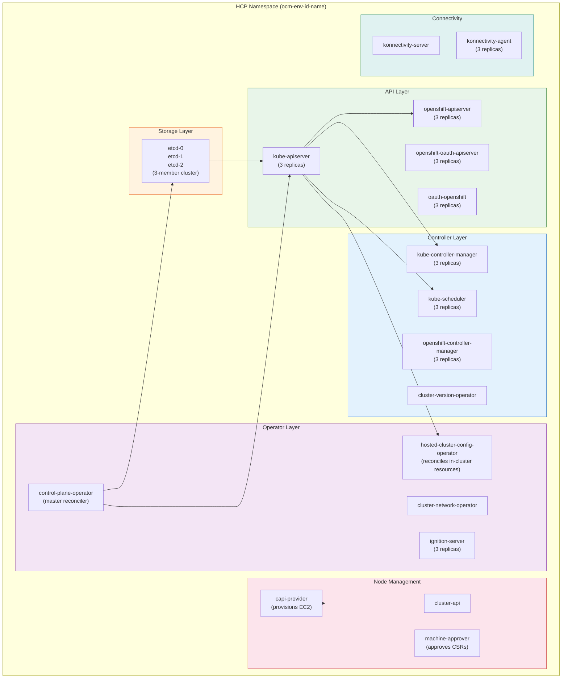
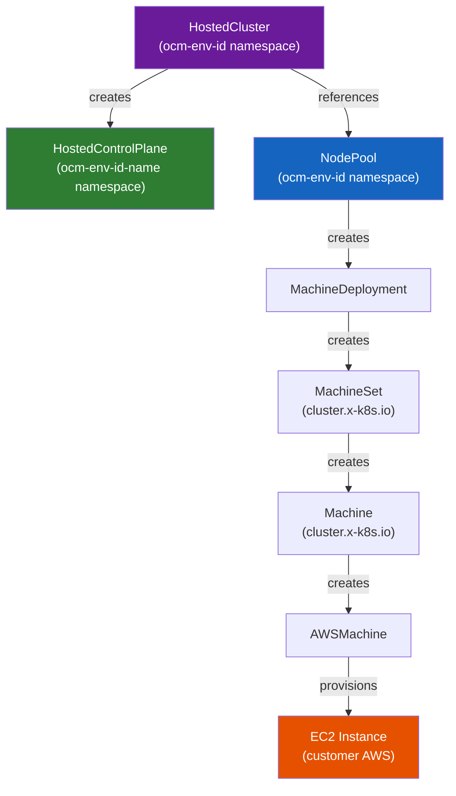

# Control Plane Deep Dive

In Classic ROSA the control plane is three EC2 master nodes. In HCP it is a **collection of pods** running in a dedicated namespace on the Management Cluster. This page explains every component and why it's there.

---

## The Control Plane Namespace

Every hosted cluster has a `hostedControlPlane` namespace on the MC:

```
ocm-${ENV}-${CLUSTER_ID}-${CLUSTER_NAME}
```

This namespace holds 30+ pods. Here are the critical ones:



---

## Component Reference

### `control-plane-operator` (CPO)
**The master reconciler of the HCP.**

- Reconciles `HostedControlPlane` CR and `AWSEndpointService` CR
- When something is wrong with the control plane setup, **start here** — CPO logs explain why resources aren't converging
- Manages certificates, configmaps, and deploys all other control plane pods
- Runs with 2 containers (operator + sidecar)

```bash
oc logs -n $CP_NS deploy/control-plane-operator -f
```

---

### `hosted-cluster-config-operator` (HCCO)
**The bridge between the MC and the hosted cluster.**

- Runs on the MC but authenticates into the **hosted cluster** (customer's cluster) to reconcile resources there
- Manages RBAC, `cluster.x-k8s.io` resources, and node count reporting
- Reports actual node count back via `HostedControlPlane.Status.NodeCount`
- If in-cluster resources (RBAC, policies) are wrong, check HCCO logs

```bash
oc logs -n $CP_NS deploy/hosted-cluster-config-operator
```

---

### `etcd` (3-member cluster)
**Distributed key-value store — the source of truth for the hosted cluster's state.**

- 3 pods for quorum (`etcd-0`, `etcd-1`, `etcd-2`)
- Stores all Kubernetes API objects for the hosted cluster
- Runs as **StatefulSets** with PersistentVolumes on the MC
- Leader election happens among the 3 members — loss of majority (2 of 3) causes cluster unavailability

!!! warning "etcd is on the MC, not the customer's AWS account"
    Unlike Classic ROSA where etcd runs on master nodes in the customer's account, HCP etcd runs entirely on the Management Cluster. The customer cannot access or corrupt it.

```bash
# Check etcd health
oc exec -n $CP_NS etcd-0 -- \
  etcdctl endpoint health \
  --cacert=/etc/etcd/tls/etcd-ca/ca.crt \
  --cert=/etc/etcd/tls/client/etcd-client.crt \
  --key=/etc/etcd/tls/client/etcd-client.key \
  --endpoints=https://etcd-client:2379

# Check leader
oc exec -n $CP_NS etcd-0 -- \
  etcdctl endpoint status \
  --cacert=/etc/etcd/tls/etcd-ca/ca.crt \
  --cert=/etc/etcd/tls/client/etcd-client.crt \
  --key=/etc/etcd/tls/client/etcd-client.key \
  --endpoints=https://etcd-client:2379 -w table
```

---

### `kube-apiserver` (3 replicas)
**The Kubernetes API server for the hosted cluster.**

- 3 replicas for high availability, each with 5 containers
- Runs on dedicated **request-serving nodes** (see [Scheduling](scheduling.md))
- Each pod has 5 containers: `kube-apiserver`, `apply-bootstrap`, `audit-logs-sidecar`, `oas-kube-aggregator`, `konnectivity-server-proxy`
- The `apply-bootstrap` container is used for [breakglass access](operations.md#breakglass-access)

---

### `capi-provider` (Cluster API)
**Provisions and manages worker EC2 instances in the customer's AWS account.**

- Reconciles `AWSMachine` CRs → calls AWS EC2 APIs to create/destroy instances
- If worker nodes fail to provision or are stuck Terminating, check capi-provider logs
- Uses AWS credentials from the HCP namespace secrets

```bash
oc logs -n $CP_NS -l app=capi-provider-controller-manager
# or
oc logs -n $CP_NS deploy/capi-provider
```

---

### `konnectivity-server` and `konnectivity-agent`
**The tunnel between the control plane and the data plane.**

- The control plane runs on the MC; workers run in customer AWS
- Direct network connectivity between them doesn't exist (they're in different VPCs)
- **Konnectivity** creates a persistent bidirectional gRPC tunnel through PrivateLink
- `konnectivity-server` runs in the HCP namespace; `konnectivity-agent` also runs there (connects to workers' agents)
- If the tunnel breaks, the API server cannot reach pods on workers → cluster appears degraded

---

### `ignition-server` (3 replicas)
**Serves Ignition configs to new worker nodes during their first boot.**

- When a new EC2 instance boots, its first action is to fetch an Ignition config
- The Ignition config tells the node: how to configure itself, what certificates to install, how to connect to the API server
- The ignition-server pod generates and serves this config
- If nodes fail to join, check ignition-server logs

```bash
oc logs -n $CP_NS -l app=ignition-server
```

---

### `cluster-version-operator` (CVO)
**Manages the OpenShift version and cluster operators.**

- Reads the desired OCP version from the `HostedCluster` spec
- Applies all cluster operator manifests from the release image
- Drives upgrades
- If a cluster operator is degraded, CVO logs show why

```bash
oc logs -n $CP_NS deploy/cluster-version-operator
```

---

### `machine-approver`
**Automatically approves TLS CSRs from new worker nodes.**

- New worker nodes generate a Certificate Signing Request (CSR) on first join
- The machine-approver validates and approves these CSRs so the node can get its kubelet certificate
- In Classic ROSA this runs in `openshift-cluster-machine-approver`; in HCP it runs in the HCP namespace

---

## Custom Resource Hierarchy



---

## HostedCluster Status Conditions

A healthy HostedCluster shows:

```bash
oc get hostedcluster -n ocm-${ENV}-${CLUSTER_ID} -o yaml | grep -A 5 "type: Available"
```

| Condition | Healthy Value | Meaning |
|-----------|--------------|---------|
| `Available` | `True` | Control plane is up and reachable |
| `Progressing` | `False` | No in-progress upgrade or change |
| `Degraded` | `False` | No component is degraded |
| `IgnitionEndpointAvailable` | `True` | New nodes can fetch ignition configs |

---

## Secrets in the hostedCluster Namespace

The `ocm-${ENV}-${CLUSTER_ID}` namespace holds break-glass secrets:

| Secret | Contents | Use |
|--------|---------|-----|
| `${cluster-name}-admin-kubeconfig` | Admin kubeconfig for the hosted cluster | Break-glass API access |
| `${cluster-name}-ssh-key` | Private SSH key for EC2 worker nodes | Worker node SSH access |

!!! danger "These secrets enable full cluster access"
    Access to these secrets requires elevated privileges. Use only in break-glass scenarios and ensure compliance audit trail.
