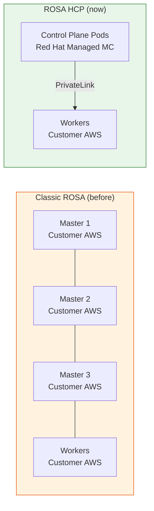

  <h1>🔴 ROSA HCP Study Guide</h1>
  
Understanding how ROSA with Hosted Control Planes really works — from architecture to operations.

# Welcome

This guide is designed for **Red Hat Managed Services engineers** who want to deeply understand how ROSA HCP (Hosted Control Planes) works — not just what commands to run, but *why* the system is built the way it is.

---

## Why HCP Exists

In a traditional ROSA (Classic) cluster, the **control plane runs inside the customer's AWS account** on three dedicated EC2 master nodes. This has several drawbacks:

- Customers pay for master nodes they never directly touch
- Every cluster needs ~45 minutes to provision (masters must boot and configure)
- SRE cannot easily access or repair a broken control plane
- Each cluster carries its own monitoring stack that customers can break
- Scaling to thousands of clusters requires thousands of master-node triples

HCP solves all of this by **moving the control plane out of the customer's account** and into Red Hat-managed clusters, while keeping worker nodes in the customer's account.

## The Mental Model

> Think of HCP like a **shared apartment building**.
> 
> - **Red Hat** owns and maintains the building foundation, roof, and utilities (control plane).
> - **Each customer** rents their own apartment (worker nodes) and does what they want inside it.
> - Customers never touch the foundation — they can't break what they can't access.

---

## Key Concepts at a Glance

  

    <h4>Service Cluster</h4>
    
One per AWS region. Runs ACM hub. Manages all Management Clusters in the region via ManifestWorks.

  

  

    <h4>Management Cluster</h4>
    
Runs the actual control plane pods for up to 80 HCPs. Owned by Red Hat, never visible to customers.

  

  

    <h4>HostedCluster CR</h4>
    
The primary Kubernetes resource representing a customer's cluster. Lives on the Management Cluster.

  

  

    <h4>NodePool CR</h4>
    
Defines worker nodes: count, instance type, OCP version. Unique to HyperShift — no Classic equivalent.

  

  

    <h4>Konnectivity</h4>
    
Bidirectional tunnel between the control plane (MC) and worker nodes (customer AWS). The bridge between worlds.

  

  

    <h4>RHOBS</h4>
    
Centralized Red Hat Observability Service. All HCP metrics flow here — customers can't break it.

  

---

## How to Use This Guide

| I want to understand... | Go to |
|-------------------------|-------|
| The overall 3-cluster structure | [Architecture Overview](architecture.md) |
| What runs inside the control plane | [Control Plane Deep Dive](control-plane.md) |
| How PrivateLink and Konnectivity work | [Networking](networking.md) |
| How a cluster is created end-to-end | [Cluster Lifecycle](lifecycle.md) |
| How nodes get assigned and sized | [Node Scheduling & Sizing](scheduling.md) |
| How monitoring and alerting work | [Monitoring & Alerting](monitoring.md) |
| How HCP differs from Classic ROSA | [HCP vs Classic ROSA](vs-classic.md) |
| Quick operational commands | [Operations Reference](operations.md) |

---

!!! info "Source"
    This guide is based on the internal `ops-sop/hypershift/knowledge_base` SOPs.
