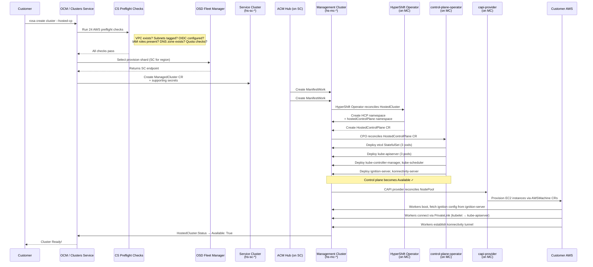
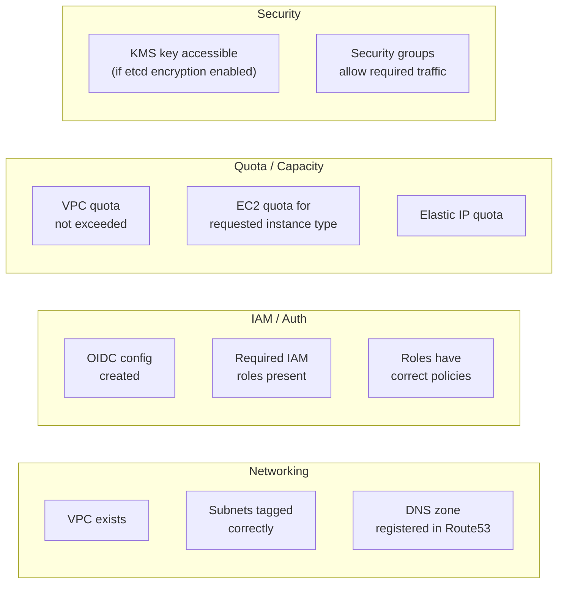
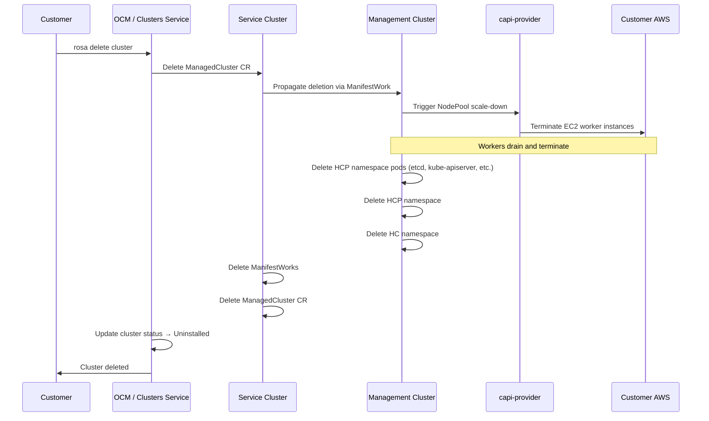
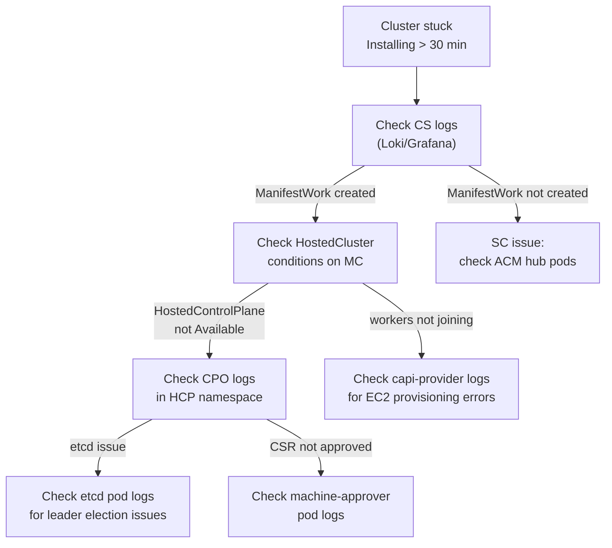
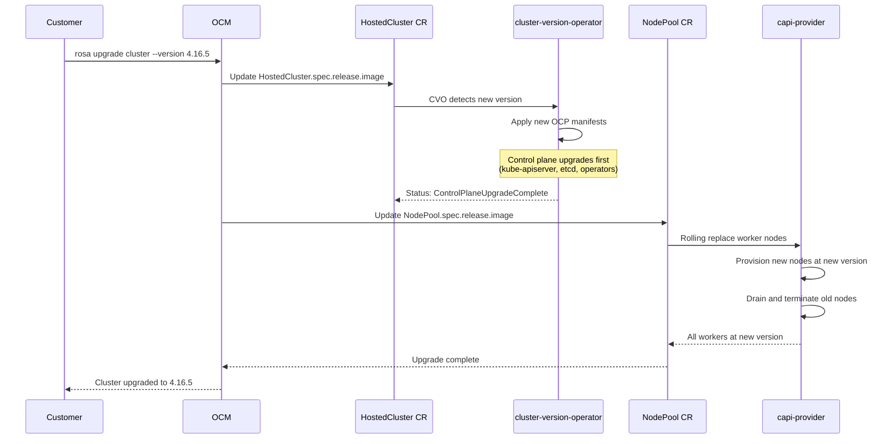

# Cluster Lifecycle

This page walks through what actually happens when a ROSA HCP cluster is created and deleted — the sequence of components involved, the CRs that get created, and where to look when something goes wrong.

---

## Creation: End-to-End Sequence



---

## The 24 Preflight Checks

Before any resource is created, Clusters Service validates the customer's AWS environment. If any check fails, the cluster creation is rejected with an actionable error.



!!! tip "Where preflight failures appear"
    Preflight check failures are returned synchronously to the OCM API and surfaced in the `rosa create cluster` output. Look for `preflight check failed:` messages. In logs, check `clusters-service` on the Grafana Loki stack.

---

## What Gets Created Where

```mermaid
graph LR
    subgraph OCM["OCM / CS Database"]
        CDATA["Cluster record\n(account, config, status)"]
    end

    subgraph SC["Service Cluster Namespace\nocm-env-clusterid"]
        MANAGED["ManagedCluster CR"]
        MW1["ManifestWork: hostedCluster"]
        MW2["ManifestWork: hosted-klusterlet"]
        SECRETS_SC["Secrets: signing-key, root-ca"]
    end

    subgraph MC_NS1["MC: ocm-env-clusterid"]
        HC["HostedCluster CR"]
        NP["NodePool CR"]
        SSH["Secret: ssh-key"]
        KUBE["Secret: admin-kubeconfig"]
    end

    subgraph MC_NS2["MC: ocm-env-clusterid-name"]
        ETCD["StatefulSet: etcd (3 pods)"]
        KAS2["Deployment: kube-apiserver"]
        ALL_CP["...all control plane pods"]
        AWSEP["AWSEndpointService CR"]
    end

    subgraph MC_NS3["MC: klusterlet-clusterid"]
        KL["Klusterlet pods"]
        POLICIES["ACM Policies"]
    end

    subgraph Customer["Customer AWS Account"]
        EC2["EC2 worker instances"]
        NLB2["NLB (for PrivateLink)"]
        VPCE["VPC Endpoint"]
    end

    OCM --> SC
    SC --> MC_NS1
    MC_NS1 --> MC_NS2
    MC_NS2 --> Customer
```



---

## Deletion: End-to-End Sequence

Deletion is the reverse of creation, but the order matters to avoid orphaning resources.



!!! warning "OIDC cleanup is separate"
    After cluster deletion, the OIDC configuration in AWS remains. It must be cleaned up manually:
    ```bash
    rosa delete oidc-config --oidc-config-id $OIDC_ID
    # or
    rosa delete oidc-provider -c $CLUSTER_ID
    ```

---

## Stuck States and Recovery

### Stuck in `Installing`



### Stuck `Uninstalling`

A common cause is a finalizer that isn't being cleared.

```bash
# Check what's blocking deletion
oc get hostedcluster -n $HC_NS -o yaml | grep -A 5 finalizers

# Check if NodePool resources are draining
oc get machines -n $HC_NS
oc get awsmachines -n $HC_NS

# Check capi-provider for errors terminating EC2
oc logs -n $HCP_NS deploy/capi-provider | tail -100
```

!!! danger "Manual finalizer removal — last resort"
    Only remove finalizers if CAPI has already confirmed the EC2 instances are terminated in the AWS console.
    ```bash
    oc patch hostedcluster -n $HC_NS $CLUSTER_NAME \
      --type=json -p '[{"op":"remove","path":"/metadata/finalizers"}]'
    ```

---

## Cluster Upgrade Lifecycle

Upgrades in HCP are decoupled: **control plane and workers upgrade independently**.



Key difference from Classic: the control plane upgrade does **not** require worker node drains — workers continue serving traffic throughout the CP upgrade.
