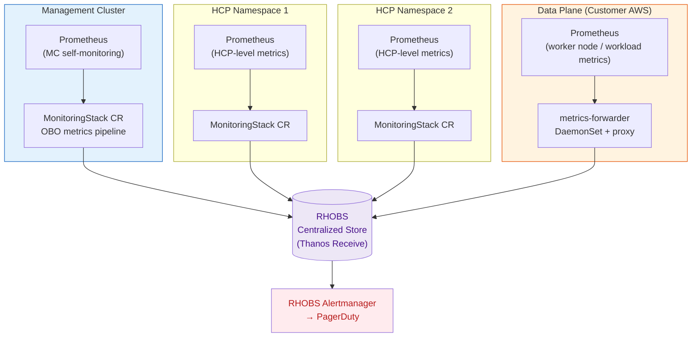
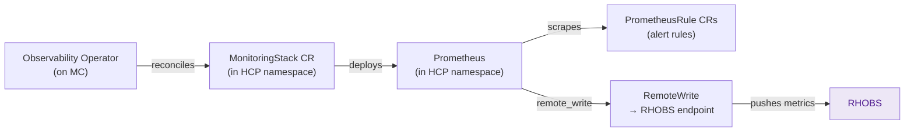
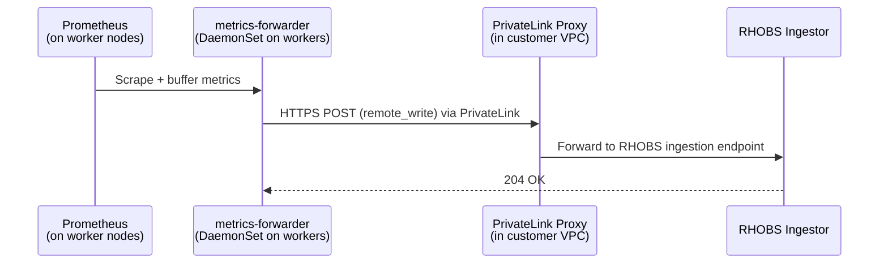
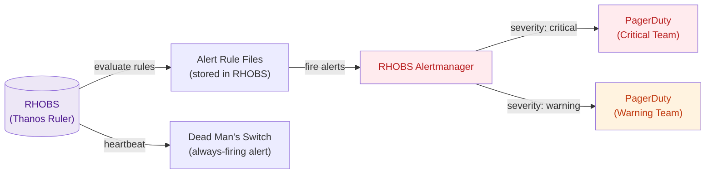
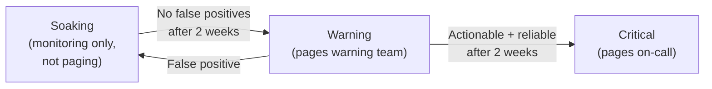

# Monitoring & Alerting

In Classic ROSA, each cluster has its own Prometheus instance. With HCP, this model doesn't scale — 80+ HCPs per Management Cluster would mean 80+ Prometheus stacks. Instead, HCP uses a **centralized observability service**: RHOBS.

---

## RHOBS: The Centralized Metrics Store

**RHOBS** (Red Hat Observability Service) is a multi-tenant, globally-scoped Prometheus-compatible metrics backend. All HCP metrics from all clusters — Management Cluster, HCPs, and Data Planes — flow there.



---

## Three Metric Sources

Each HCP has metrics flowing from **three distinct sources**:

| Source | What it measures | Label added |
|--------|-----------------|-------------|
| **Management Cluster** | kube-apiserver pod CPU/memory, etcd performance, component health | `_mc_id="hs-mc-xxxxx"` |
| **HCP level** | per-HCP control plane component metrics (kube-apiserver request rates, etcd leader changes) | `_id="customer-cluster-id"` |
| **Data Plane** | worker node CPU/memory, kubelet metrics, custom workload metrics | `_id="customer-cluster-id"`, `source="customer"` |

### Metric Labels for Querying

All metrics in RHOBS are tagged with these labels:

```promql
# Example: find all metrics from a specific HCP
{_id="abc123def456"}

# Example: find all metrics from a specific MC
{_mc_id="hs-mc-1sek0vq5g"}

# Example: find all metrics from a region
{_id="abc123", region="us-east-1"}

# Example: find data plane metrics only
{_id="abc123", source="customer"}
```

---

## Observability Operator (OBO) and MonitoringStack

The **Observability Operator (OBO)** manages the metrics pipeline within each HCP namespace using a `MonitoringStack` CR.



The `MonitoringStack` CR configures:
- Prometheus retention (usually short — data is pushed, not stored)
- RemoteWrite endpoint (RHOBS ingress URL + auth token)
- Scrape targets (the HCP components)

```bash
# View MonitoringStack in an HCP namespace
oc get monitoringstack -n $HCP_NS
oc describe monitoringstack -n $HCP_NS $STACK_NAME
```

---

## Data Plane Metrics: The Push Model

Worker node metrics can't be pulled by RHOBS (the DP is in a separate VPC). Instead, a **push model** over PrivateLink is used.



- `metrics-forwarder` runs as a DaemonSet on worker nodes
- Each forwarder has a certificate provisioned via the hosted cluster's CA
- Traffic routes through the same PrivateLink endpoint used by the kubelet
- Zero egress clusters use this exclusively — no internet access required

---

## Alerting Architecture



### Alert Rule Categories

| Category | File Pattern | Examples |
|----------|-------------|---------|
| Cluster health | `cluster-*.yaml` | `HostedClusterAvailable`, `HostedClusterDegraded` |
| etcd | `etcd-*.yaml` | `EtcdHighNumberOfLeaderChanges`, `EtcdNoLeader` |
| API server | `kube-apiserver-*.yaml` | `KubeAPIErrorBudgetBurn`, `KubeAPILatencyHigh` |
| Node pool | `nodepool-*.yaml` | `NodePoolDegraded`, `NodePoolNotScaling` |
| Konnectivity | `konnectivity-*.yaml` | `KonnectivityServerDown` |
| Capacity | `capacity-*.yaml` | `RequestServingNodePoolLow` |

### Alert Severity Routing

| Severity | PagerDuty team | Response SLA |
|---------|---------------|-------------|
| `critical` | On-call (24/7) | Immediate |
| `warning` | Engineering | Business hours |
| `info` | (no page) | Dashboards only |

---

## Alert Graduation Pipeline

New alerts don't go directly to `critical`. They go through a graduation pipeline to reduce alert fatigue:



!!! tip "Before escalating an alert issue"
    Check if the alert is in soaking or warning phase — it may be a known-unreliable alert that's being tuned.

---

## Automatic Alert Suppression

When a cluster is intentionally degraded (e.g., during maintenance), alerts can be automatically suppressed:

```bash
# Suppress all alerts for a cluster
oc annotate hostedcluster -n $HC_NS $CLUSTER_NAME \
  hypershift.openshift.io/disable-cluster-alerts=true

# Remove suppression
oc annotate hostedcluster -n $HC_NS $CLUSTER_NAME \
  hypershift.openshift.io/disable-cluster-alerts-
```

When `hypershift_cluster_alerts_disabled` metric is `1`, the RHOBS Alertmanager inhibition rules suppress all HCP-specific alerts for that cluster.

---

## Querying Metrics in RHOBS

```bash
# Via Grafana (preferred for dashboards)
# Use the RHOBS Grafana instance for your environment

# Via promtool / curl (for quick checks)
curl -H "Authorization: Bearer $TOKEN" \
  "https://rhobs.example.com/api/v1/query?query=up{_id='$CLUSTER_ID'}"
```

### Useful Queries

```promql
# Is the HCP available?
hypershift_cluster_available{_id="$CLUSTER_ID"}

# etcd leader changes in the last hour
increase(etcd_server_leader_changes_seen_total{_id="$CLUSTER_ID"}[1h])

# kube-apiserver request latency (p99)
histogram_quantile(0.99, sum by (le) (
  rate(apiserver_request_duration_seconds_bucket{_id="$CLUSTER_ID"}[5m])
))

# Worker node memory usage
sum(node_memory_MemUsed_bytes{_id="$CLUSTER_ID"}) by (instance)
```
