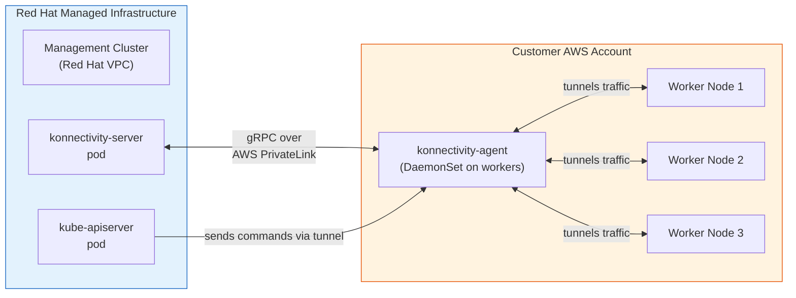
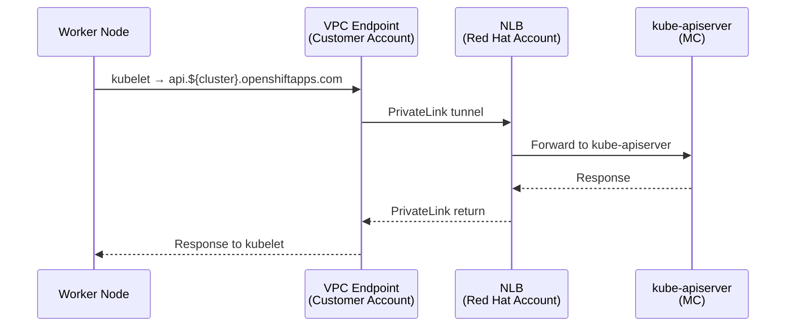
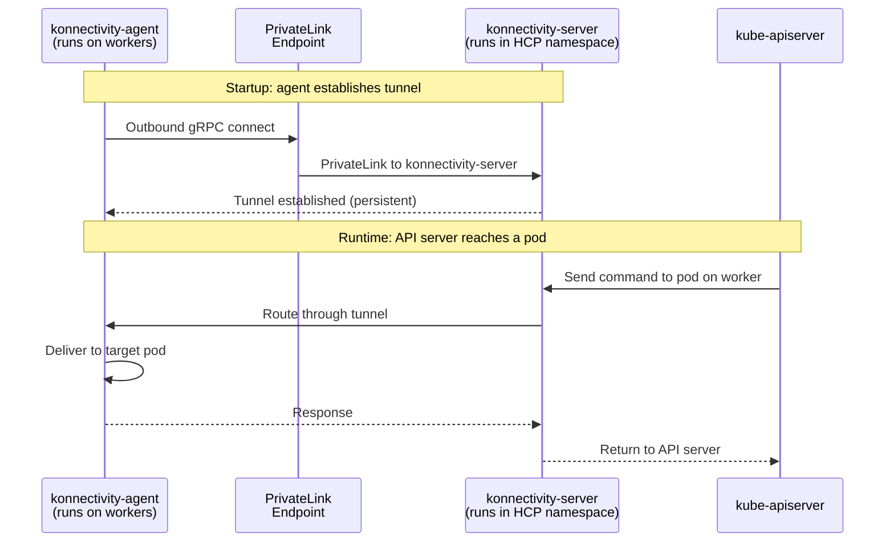
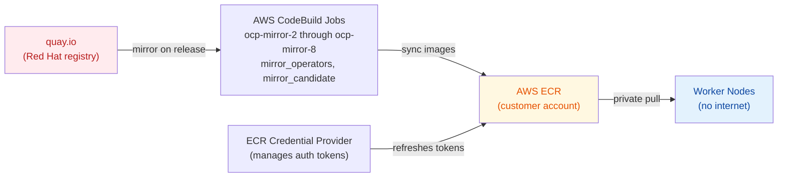
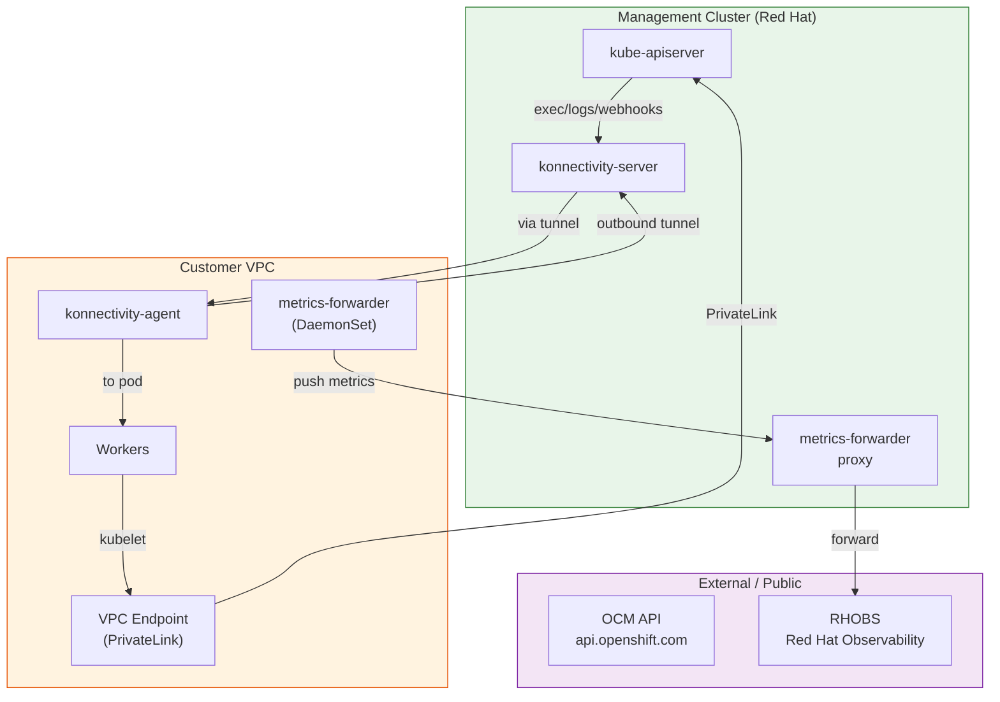

# Networking: PrivateLink & Konnectivity

The fundamental networking challenge in HCP is this: **the control plane (etcd, kube-apiserver) runs on a Red Hat-owned Management Cluster, while the worker nodes run in the customer's AWS account**. These two environments live in completely separate VPCs with no direct peering. This page explains how they communicate.

---

## The Two-Way Connectivity Problem



The solution uses **two complementary technologies**:

| Technology | Direction | Purpose |
|------------|-----------|---------|
| AWS PrivateLink | Customer → Red Hat | Exposes the MC's API endpoint privately into the customer's VPC |
| Konnectivity | Red Hat → Customer | Provides the reverse tunnel so the API server can reach pods on workers |

---

## AWS PrivateLink: Customer VPC → MC

**PrivateLink** lets the customer's workers reach the kube-apiserver without exposing it on the public internet.



Key points:
- Each hosted cluster gets its own **NLB** (Network Load Balancer) in the Red Hat VPC
- A **VPC Endpoint Service** is created from that NLB
- A **VPC Endpoint** is created in the customer's VPC pointing to the endpoint service
- Workers resolve `api.${cluster}.openshiftapps.com` → private VPC endpoint IP
- **No traffic crosses the public internet**

The CR that tracks this on the MC:
```bash
oc get awsendpointservice -n $CP_NS
oc describe awsendpointservice $CLUSTER_NAME -n $CP_NS
```

---

## Konnectivity: MC → Worker Nodes

The kube-apiserver needs to reach pods on worker nodes (e.g., for `oc exec`, `oc logs`, admission webhooks). Without Konnectivity, this would require a separate VPN or peering back the other way.

**Konnectivity** solves this by having workers establish a persistent outbound tunnel to the MC:



Key points:
- `konnectivity-agent` runs as a **DaemonSet** on all worker nodes
- The agent dials out to `konnectivity-server` (in the HCP namespace on the MC) over PrivateLink
- The connection is **initiated by the worker** — no inbound firewall rules needed in the customer VPC
- **All traffic from API server → pod** is multiplexed through this single tunnel

---

## Zero Egress: No NAT, No IGW

For clusters in **Zero Egress** mode, worker nodes have **no internet access at all** — no NAT gateway, no Internet Gateway.

This poses a challenge: workers need to pull container images. The solution is mirroring:



- Red Hat-owned CodeBuild jobs copy OCP release images from quay.io → customer ECR repositories
- Workers pull images from ECR over internal AWS networking (no internet)
- An ECR Credential Provider refreshes the `~/.docker/config.json` tokens periodically
- If a worker fails with `ImagePullBackOff`, check if the ECR mirror job ran for that release version

---

## Network Flows Summary



| Flow | Protocol | Path |
|------|----------|------|
| Worker kubelet → API | HTTPS | PrivateLink → MC NLB → kube-apiserver |
| API server → Pod (exec/logs) | gRPC | konnectivity tunnel |
| Worker → OCP images | HTTPS | ECR (internal, no internet) |
| Metrics → RHOBS | HTTPS | metrics-forwarder → PrivateLink → RHOBS |
| OCM → Provision cluster | HTTPS | OCM API → SC → MC (ManifestWork) |

---

## Troubleshooting Network Issues

```bash
# Check the PrivateLink endpoint service
oc get awsendpointservice -n $CP_NS

# Check konnectivity tunnel status
oc logs -n $CP_NS deploy/konnectivity-server
oc logs -n openshift-konnectivity-agent konnectivity-agent-$NODE

# Check if workers can reach the API server
oc exec -n $CP_NS -it debug-pod -- curl -k https://api.${CLUSTER}.openshiftapps.com:6443/healthz

# Check ECR credential provider (zero egress)
oc logs -n openshift-cloud-credential-operator -l app=cloud-credential-operator
```
