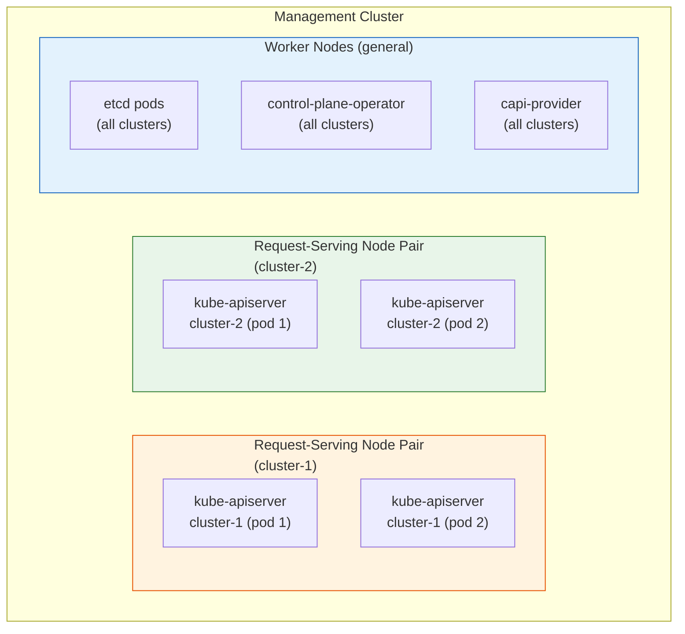
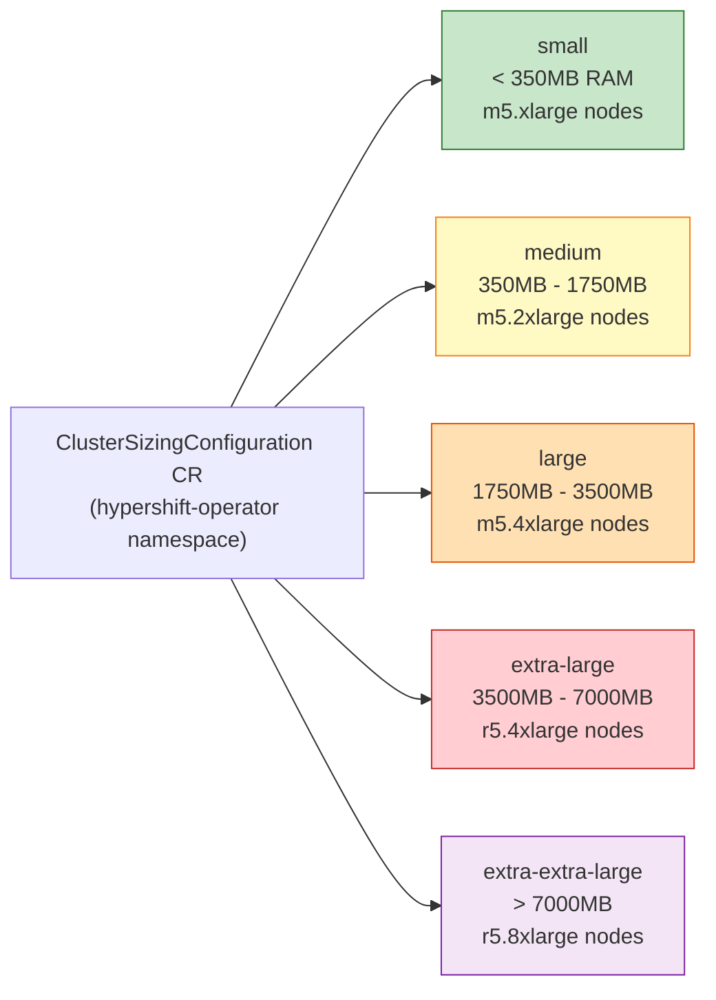
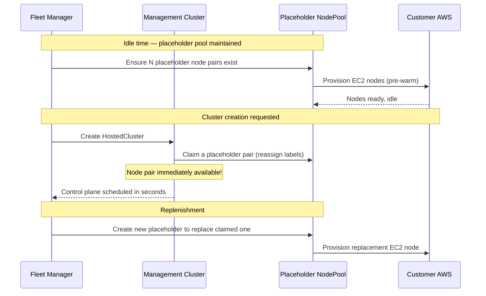
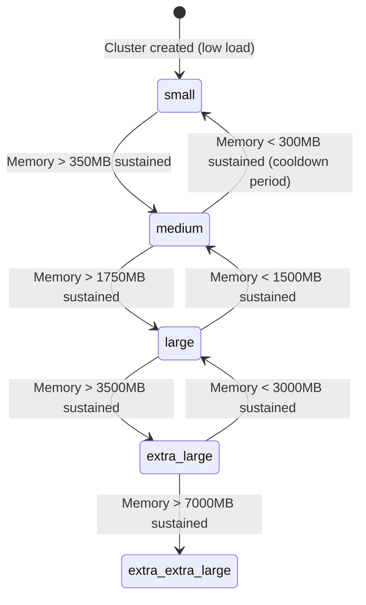

# Node Scheduling & Sizing

HCP clusters don't run on generic nodes — they run on nodes selected specifically for the memory requirements of the control plane they're hosting. This page explains how that selection works.

---

## Why Dedicated Request-Serving Nodes?

In Classic ROSA, kube-apiserver runs on a dedicated master node (one of three). In HCP, multiple control planes share a Management Cluster, and each HCP's kube-apiserver runs as pods. Without dedicated nodes, kube-apiserver pods from different clusters would compete for the same CPU/memory, and a large or busy HCP could starve smaller ones.

The solution is **request-serving nodes**: dedicated pairs of nodes, one per HCP, that exclusively serve that HCP's kube-apiserver pods.



Request-serving nodes are:
- Deployed **in pairs** across 2 AZs (for HA)
- **Tainted** with `hypershift.openshift.io/request-serving-component: "true"` so only HCP pods schedule there
- **Labeled** with the cluster ID so anti-affinity rules pin pods to the right pair

---

## T-Shirt Sizing: Memory-Based Scaling

The size of the request-serving nodes is determined by the **memory requirements** of the control plane pods. This is called "t-shirt sizing" — clusters are bucketed into sizes based on observed memory usage.



### How Sizing is Calculated

The HyperShift Operator samples the control plane pod memory every few minutes and updates the `HostedCluster.Status.OAuthCallbackURLTemplate` with the computed size class.

```bash
# View the sizing configuration
oc get clustersizingconfiguration -n hypershift-operator cluster -o yaml

# See what size a cluster is currently assigned
oc get hostedcluster -n $HC_NS $CLUSTER_NAME -o jsonpath='{.status.platform.aws.requestServingNodeType}'
```

---

## The Placeholder System: Fast Provisioning

Node provisioning takes time (~3–5 minutes for EC2 + bootstrap). If every new HCP had to wait for fresh nodes to provision, cluster creation would be very slow.

**Placeholders** solve this by maintaining a pool of warm, pre-provisioned request-serving nodes that are available immediately when a new HCP is created.



!!! info "Placeholder ConfigMap"
    The number of placeholder pairs per size class is controlled by a ConfigMap. Fleet Manager adjusts this based on regional demand patterns.

---

## How Pods Find Their Nodes

Scheduling is enforced through a combination of **node selectors**, **tolerations**, and **pod affinity rules** — all managed by the HyperShift Operator.

### Node Labels (what nodes announce)

```yaml
# Request-serving nodes carry these labels:
hypershift.openshift.io/request-serving-component: "true"
hypershift.openshift.io/cluster: "ocm-prod-abc123"  # cluster-specific
topology.kubernetes.io/zone: "us-east-1a"            # AZ label
```

### Pod Anti-Affinity (what kube-apiserver pods require)

```yaml
# kube-apiserver pods require:
affinity:
  nodeAffinity:
    requiredDuringSchedulingIgnoredDuringExecution:
      nodeSelectorTerms:
      - matchExpressions:
        - key: hypershift.openshift.io/cluster
          operator: In
          values: ["ocm-prod-abc123"]
  podAntiAffinity:
    requiredDuringSchedulingIgnoredDuringExecution:
    - topologyKey: topology.kubernetes.io/zone
      # Ensure pods spread across 2 AZs
```

### Tolerations (what pods must have to schedule on tainted nodes)

```yaml
tolerations:
- key: hypershift.openshift.io/request-serving-component
  value: "true"
  effect: NoSchedule
```

---

## Autoscaling: T-Shirt Transitions

When an HCP's memory usage crosses a size boundary, the cluster transitions to a larger t-shirt size:



A size transition triggers:
1. HyperShift Operator updates the node selector on kube-apiserver pods
2. New (larger) request-serving nodes are provisioned or claimed from placeholder pool
3. kube-apiserver pods migrate to larger nodes
4. Old smaller nodes are released and potentially terminated

---

## Troubleshooting Node Assignment

```bash
# Is the cluster assigned a size class?
oc get hostedcluster -n $HC_NS $CLUSTER_NAME \
  -o jsonpath='{.status.platform.aws.requestServingNodeType}'

# Are the right request-serving nodes available?
oc get nodes -l hypershift.openshift.io/cluster=$HC_NS \
  --show-labels

# Is a kube-apiserver pod pending?
oc get pods -n $HCP_NS -l app=kube-apiserver | grep Pending
oc describe pod -n $HCP_NS $PENDING_POD | grep -A 10 Events

# Is there a placeholder deficit?
oc get configmap -n hypershift-operator \
  -l hypershift.openshift.io/placeholder-size
```

!!! warning "Pods Pending on Scheduling"
    If kube-apiserver pods are `Pending`, the most common causes are:
    1. No available request-serving nodes for this size class
    2. AZ mismatch (anti-affinity can't be satisfied)
    3. Taint not tolerated (pod config out of sync with node config)
    Start with `oc describe pod` → Events, then check node labels.
