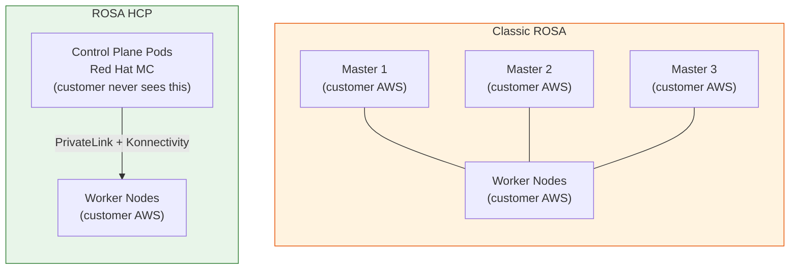
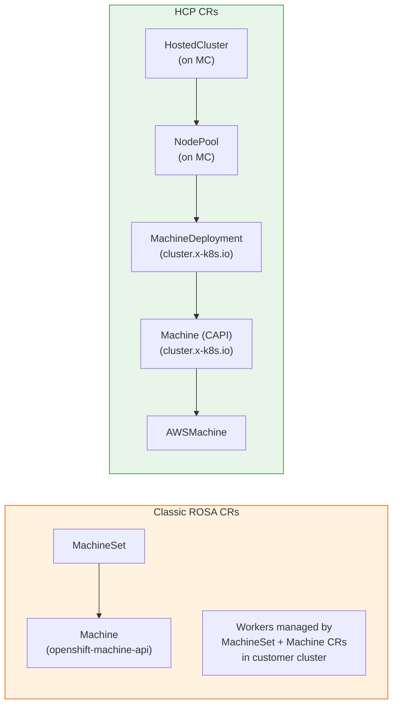

# HCP vs Classic ROSA

A side-by-side comparison of the two ROSA architectures. Understanding the differences helps explain both why HCP exists and why certain support procedures are different.

---

## Architecture Comparison

---

## Key Differences Table

| Aspect | Classic ROSA | ROSA HCP |
|--------|-------------|----------|
| **Control plane location** | Customer AWS (3 master nodes) | Red Hat MC (pods in HCP namespace) |
| **Control plane visibility** | Customer can SSH to masters | Customer has no access to control plane |
| **Master node cost** | Customer pays for 3 × m5.2xlarge+ | None — control plane is shared |
| **Provisioning time** | ~45 minutes | ~5-15 minutes (placeholder nodes) |
| **Control plane HA** | 3 nodes across 3 AZs | 3 pods across 2 request-serving nodes |
| **etcd location** | 3 masters in customer VPC | StatefulSet in MC (Red Hat VPC) |
| **etcd access** | Customer can access etcd | Customer cannot access etcd |
| **Monitoring stack** | Per-cluster Prometheus | Shared RHOBS (centralized) |
| **Monitoring corruption** | Customer can break their Prometheus | Customer cannot break RHOBS |
| **Control plane upgrades** | Requires node drain/reboot | In-place pod rolling update |
| **Worker upgrades** | Same version as control plane | Decoupled — can differ by minor version |

---

## Custom Resource Differences

### Where to Find Worker Node CRs

| Task | Classic ROSA | ROSA HCP |
|------|-------------|---------|
| List worker machines | `oc get machines -n openshift-machine-api` (in the cluster) | `oc get machines -n $HCP_NS` (on MC) |
| Scale worker nodes | `oc scale machineset -n openshift-machine-api` | `oc edit nodepool -n $HC_NS` or OCM API |
| Approve CSRs | `oc get csr` + approve in the cluster | machine-approver pod in HCP namespace auto-approves |

---

## Namespace Differences

### Classic ROSA (in the customer's cluster)

| Namespace | Purpose |
|-----------|---------|
| `openshift-etcd` | etcd pods (3 replicas on masters) |
| `openshift-kube-apiserver` | kube-apiserver pods (on masters) |
| `openshift-machine-api` | Machine, MachineSet CRs + Machine API Operator |
| `openshift-monitoring` | Prometheus, Alertmanager, Grafana |

### ROSA HCP (on the MC)

| Namespace | Purpose |
|-----------|---------|
| `hypershift` | HyperShift Operator itself |
| `ocm-${env}-${clusterid}` | HostedCluster CR, NodePool CR |
| `ocm-${env}-${clusterid}-${name}` | All control plane pods (etcd, kube-apiserver, etc.) |
| `klusterlet-${clusterid}` | ACM Klusterlet + compliance policies |

### In the customer's hosted cluster (HCP)

| Namespace | Present? | Notes |
|-----------|---------|-------|
| `openshift-etcd` | No | etcd is on the MC |
| `openshift-kube-apiserver` | No | kube-apiserver is on the MC |
| `openshift-machine-api` | No | Replaced by CAPI on MC |
| `openshift-monitoring` | Partial | Prometheus present but remote-writes to RHOBS |

---

## Operational Procedure Differences

### Access to Control Plane Logs

| Classic | HCP |
|---------|-----|
| `oc logs -n openshift-kube-apiserver` (in the cluster) | `oc logs -n $HCP_NS deploy/kube-apiserver` (on MC) |
| SSH to masters | No SSH — use breakglass procedures |

### Break-Glass Access

| Classic | HCP |
|---------|-----|
| SSH to master node | Admin kubeconfig secret in HCP namespace on MC |
| `oc debug node/master-X` | `oc exec -it -n $HCP_NS $KAS_POD -c kube-apiserver -- /bin/bash` |
| `crictl` via SSH | SSM Session Manager → worker nodes |

### Cluster Upgrades

| Classic | HCP |
|---------|-----|
| Control plane + workers upgrade together | Control plane upgrades first, then workers independently |
| 1 upgrade version per cluster | NodePool can lag behind by up to 1 minor version |
| Masters drain before upgrade | No draining of masters (there are none) |

---

## Support Troubleshooting Comparison

| Problem | Classic: Where to look | HCP: Where to look |
|---------|----------------------|-------------------|
| API server errors | `oc logs -n openshift-kube-apiserver` in cluster | `oc logs -n $HCP_NS deploy/kube-apiserver` on MC |
| etcd issues | `oc exec -n openshift-etcd etcd-master-X` in cluster | `oc exec -n $HCP_NS etcd-0` on MC |
| Worker not joining | `oc get machines -n openshift-machine-api` in cluster | `oc get machines -n $HCP_NS` on MC; check capi-provider |
| OCP upgrade stuck | CVO logs in cluster | CVO logs in `$HCP_NS` on MC |
| Monitoring missing | Check Prometheus in `openshift-monitoring` | Check RHOBS; check MonitoringStack CR in HCP namespace |
| Certificate expired | `oc get csr` + rotate in cluster | CPO rotates certs automatically; check CPO logs if failing |

---

## When to Use Which

!!! info "ROSA HCP is the default for new clusters (2024+)"
    Since ROSA HCP reached GA, it is the recommended deployment model for new customers. Classic ROSA remains supported but is not recommended for new deployments.

| Scenario | Use Classic | Use HCP |
|----------|------------|---------|
| Need to SSH to masters | ✓ | |
| Need fastest provisioning | | ✓ |
| Cost-sensitive (no master node cost) | | ✓ |
| Need independent control plane/worker upgrades | | ✓ |
| Need SRE-inaccessible control plane | | ✓ |
| Existing workloads depending on Classic APIs | ✓ | |
